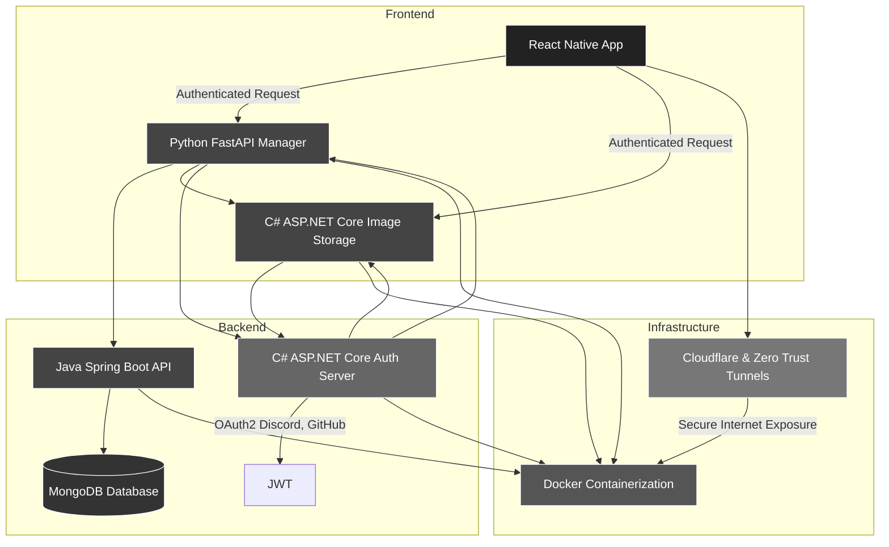

</img>

# Photon

This project was made by team `cuckoo banana` for Syntax Error 2024.
## Akshat Srivastava 24114010
## Gravit Sharma 24116035
## Satindra Ramalingam 24114087
## Tanmay Arya 24114099

# Download

You can download the app from [Github Releases](https://github.com/phot-ON/Photon/releases)

Only available for android because apple 💀

# What is Photon?

Photon is a React Native mobile application designed to simplify photo sharing when hanging out with friends. It allows users to create and join a session where every picture taken by anyone in the group is instantly synced to every participant’s device in real-time. No more tedious manual sharing through messaging apps or cloud services—Photon automates the process, making sure every memory is shared with the group instantly.

# Getting the source code

There are 5 major parts of this project (because we are all good at different languages) which can be accessed at their respective git repos.
[React native front end](https://github.com/phot-on/App)
[ASP.NET Core Authentication Server](https://github.com/phot-on/Photon.Auth)
[ASP.NET Core Image Database](https://github.com/phot-on/Photon.ImageDb)
[Python FastAPI Master Server](https://github.com/phot-on/orchestrator)
[Spring-boot MongoDb Server](https://github.com/phot-on/ProtonDb)

# Understanding the structure

# Diving into the components

## React-Native frontend
The android app for this project is made in react native, TailwindCSS is used for styling and recoil is used for state management. Deeplinking is used throughout the application for the convenience of the users.

## ASP.NET Auth Server
Authentication is done using OAuth2 from two proivders: Github and Discord (Google would require verification which would have taken more than 36h just to get verified)
Only email, name, and profile picture is used from the providers, the user account's IDs are their respective emails, as to avoid the headache of account merging.
After the info is taken from indentity provider, a JWT is generated which is used for all communication between the client and server

## ASP.NET Image Database
The images taken while the user is part of a session are sent directly to the image server, where they are first hashed and then stored, for security.
The images are stored in ./Images/{session_id}/{image_hash}. Every request to this server is authenticated to make sure it does not get misused.
A cron job which runs every 4 hours clears all images which are older than 5 hours, so no data is stored for long periods of time, for privacy and storage reasons.

## Spring-boot Mongodb Server
All other data like users, friends, sessions etc are stored on mongodb, which is accessed through a http server made in java/springboot (Maven). Mongodb was chosen because of its simplicity to implement.

## Python Orchestrator Server
A python FastAPI server is used to connect all the microservices together, made in FastAPI because of its speed (duh) and because of its native OpenAPI support (we never used that). All requests from client (except those to imagedb) go through this server which first authenticates it, and then returns data fetched from other services.

# Infrastructure

## Cloudflare

The web servers are open at https://photon.garvit.tech (orchestrator) and https://photon.garvit.tech/images (imagedb)
Both of these are protected behind cloudflare. Additionally the connection between server and cloudflare is made using ZT Tunnel (will answer why later)

## Docker

All of these microservices are hosted using docker, Dockerfile of each microservice can be found inside their respective repository.
Docker compose is used to deploy all the services at the same time and with ease, docker compose also allows easy network setup between the microservices for easy communication.
The docker compose file can be found in this repo.

## Self hosting

All the microservices are hosted on my PC (I use Arch btw) in my hostel room, which runs 24x7 (i dont pay the bills). I have set my pc to always stay on and to stay started whenever power is available, self hosting is the reason why the latency may be bad (blame IITR wifi), because every device uses the same IP under wifi and i cannot open any ports to the public I have to use ZT Tunnels.

# Future scope

## Switching to SQL
SQL based databases can be used as the complexity increase and schemas may be necessary.

## Caching
Redis caching was skipped due to shortage of time but it is a must have for applications of all size

## Kubernetes
As the app grows we could move it to kubernetes for scalibility

## Cloud Hosting
As the app grows it cannot be hosted on personal machines, it must be hosted on cloud providers like AWS, GCP etc

# Honourable Mentions

## Tailscale

All devices were added to one tailscale network for easy testing, we wouldve never finished this project on time.

## Firebase
Used to send notifications and messages to the application
